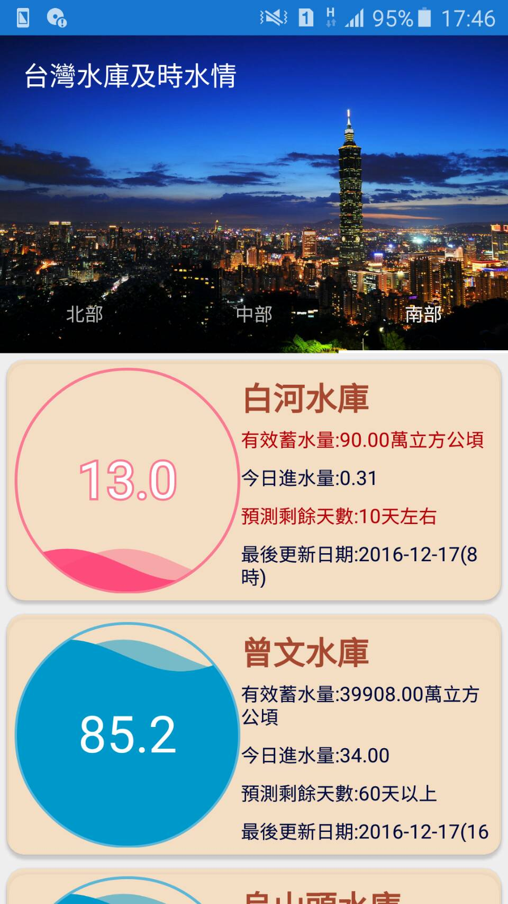

# 台灣水庫即時水情

使用技術：Android、Http Request、SQLite

簡介：

>此App是利用經濟水利署水利資料平台的即時水庫水量資訊，能夠查詢全台二十個水庫及資訊，內部欄位包含有效蓄水量、今日進水量、以及預測剩餘天數。

Google Play商店下載：https://play.google.com/store/apps/details?id=com.f74372017.twreservoir&hl=zh_TW
